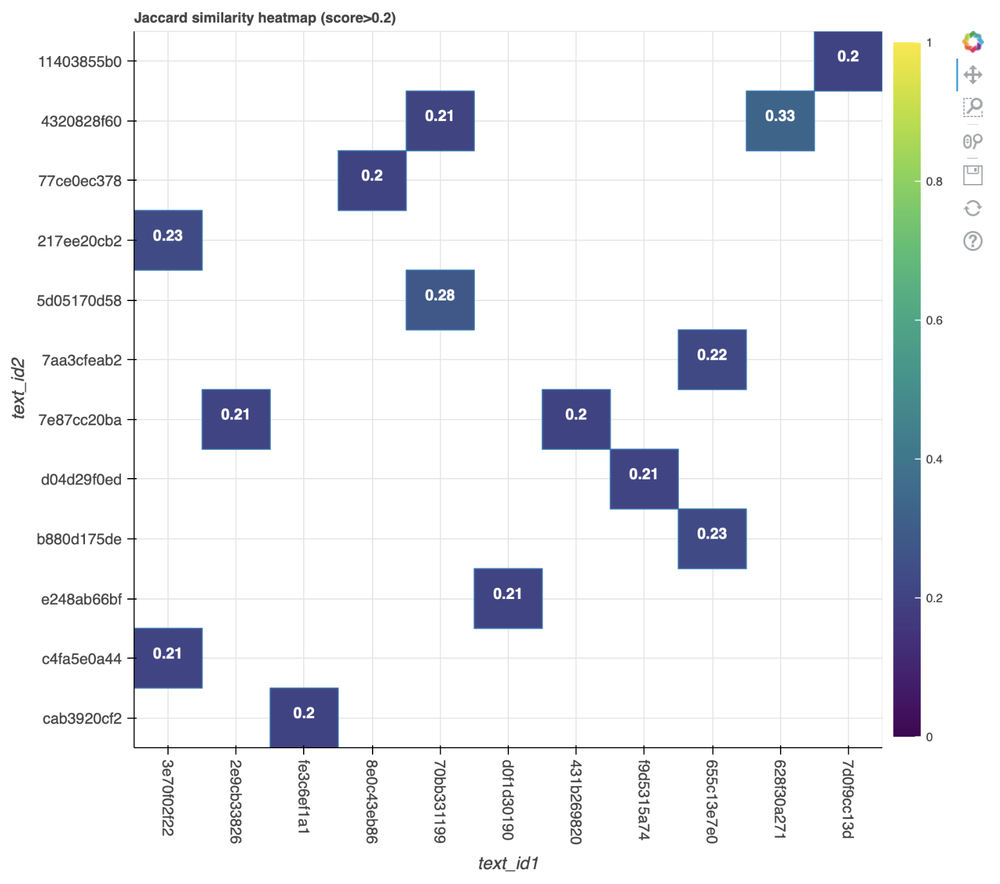

# Document Similarity

<b>Abstract:</b> in this notebook, you can use the DocumentSimilarity tool to identify similar documents in your corpus and decide whether to 'keep' or 'remove' them from the corpus.  

## Setup
This tool has been designed for use with minimal setup from users. You are able to run it in the cloud and any dependencies with other packages will be installed for you automatically. In order to launch and use the tool, you just need to click the below icon.

    

<b>Note:</b> CILogon authentication is required. You can use your institutional, Google or Microsoft account to login.  

It may take a few minutes for Binder to launch the notebook and install the dependencies for the tool. Please be patient.  

## Load the data
<table style='margin-left: 10px'><tr>
<td>  </td>
<td>  </td>
<td>  </td>
<td>  </td>
</tr></table>

This tool will allow you upload text data in a text file (or a number of text files). Alternatively, you can also upload text inside a text column inside your excel spreadsheet 

<b>Note:</b> If you have a large number of text files (more than 10MB in total), we suggest you compress (zip) them and upload the zip file instead. If you need assistance on how to compress your file, please check [the user guide](https://github.com/Sydney-Informatics-Hub/HASS-29_Quotation_Tool/blob/main/documents/jupyter-notebook-guide.pdf).  

## Calculate Document Similarity
Once your texts have been uploaded, you can begin to calculate the similarity between documents in the corpus. You can then visualise the count of similar documents found by the tool on an histogram (as shown below).  

  

Alternatively, you can visualise the pair of similar documents and their Jaccard similarity on a heatmap (as shown below).  

  

You can also show pair of identified similar documents side-by-side, decide whether to 'keep' or 'remove' them and finally, download the non-duplicated documents to your local computer.  

 

## Reference
This tool uses [MinHash](https://ekzhu.com/datasketch/minhash.html) to estimate the Jaccard similarity between sets of documents. MinHash is introduced by Andrei Z. Broder in this [paper](https://cs.brown.edu/courses/cs253/papers/nearduplicate.pdf).

